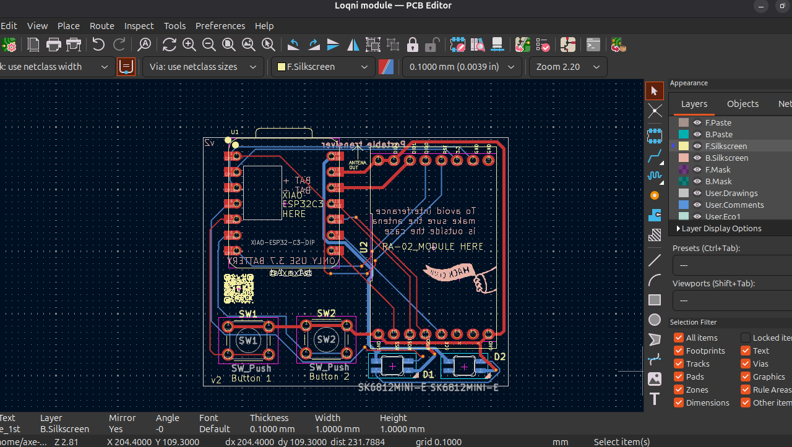

# Loqni-Transmitter-
> An Attachment for your phone or laptop to communicate outdoors! You could use this for camping. Powered by an Xiao Esp32c3 and Ra-02_module!
This Project requires 2 modules. It works by opening a webportal which you use to talk/messsage to the eps32c3 then it will direct the message in a spicific channel by ussing the ra -02 module

<h2>OVERVIEW</h2>

-no ra-02 module stl online

> It has:
+ 3.7 bat
+ momentary button
+ xiao esp 32c3
+ Ra-02 module
+ sma pigtail
+ Antena 433mhz
+ Power Switch
+ Pcb
+ Case

<h3>PCB</h3>

-1st version

-2nd version

<h3>schematic</h3>

<h3>Case</h3>
> 4 part and multiplied by 2! 

<h2>Bill of Materials</h2>

-some in php 

-Budget 50 + 15 dollars top up

-CONVERSION RATE: 1 United States Dollar equals 57.57 Philippine peso

[View the full BOM SHEET here](./Main/BOM/Untitled%20spreadsheet%20-%20Sheet1.csv)

<h2>Shopee info</h2>

-GRANT:₱3741.79/$65

-MERCHANDISE TOTAL: ₱1,764

-SHIPPING TOTAL:₱344

-VOUCHER DISCOUNT: -₱29

-ALL TOTAL:₱2,079/$36.12

-REMAINING:₱1663/$28.89

*Shipping fee changes/fluxuates but the shipping above sometimes its free*

<h2>JLC PCB</h2>
-5 pcb
-$3.50 or 201.09 php
-remaining:₱1462 /$25.40

-Printing legion (around 10 or more dollars)
-remaining ₱886.34/$15.40 (will give the remaining money back)

-Not included:
-SK6812MINI-E (i still have)
